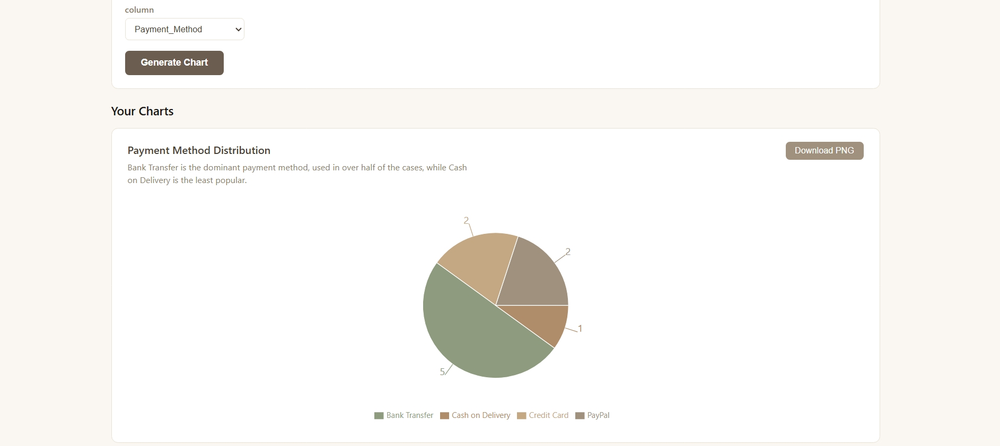
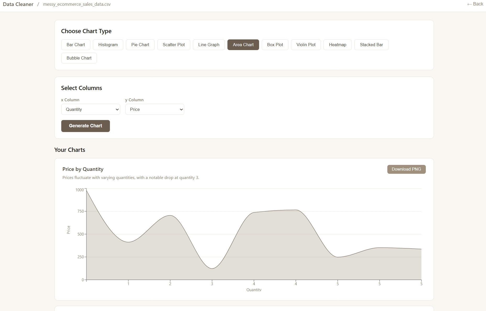
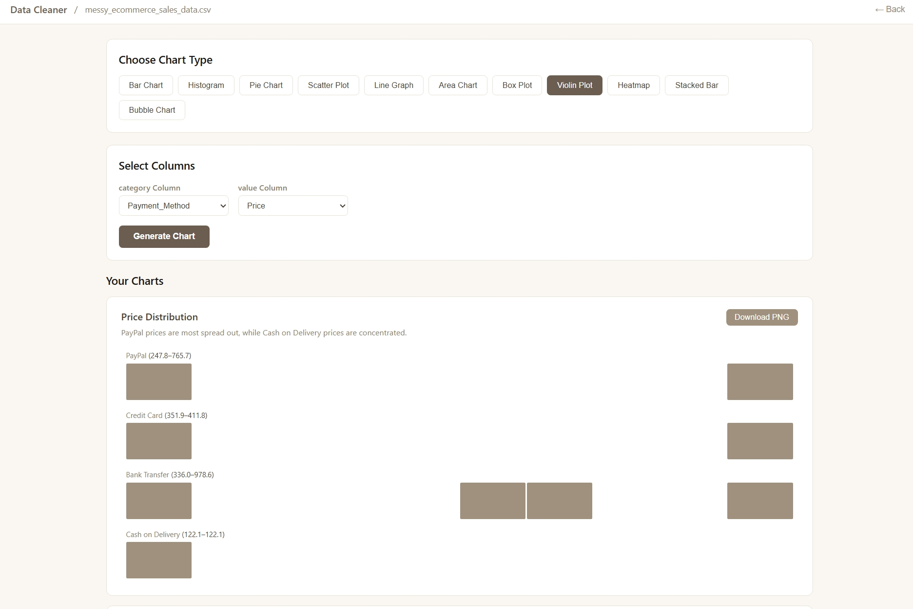
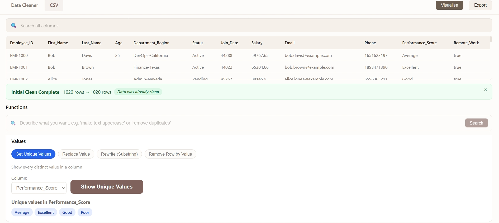
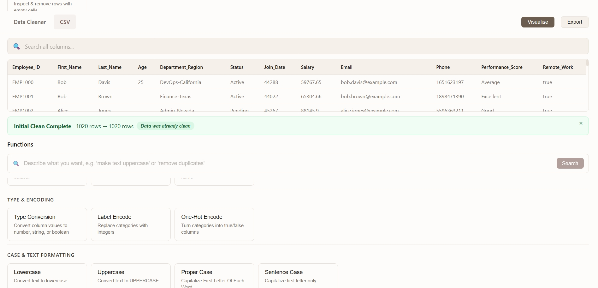
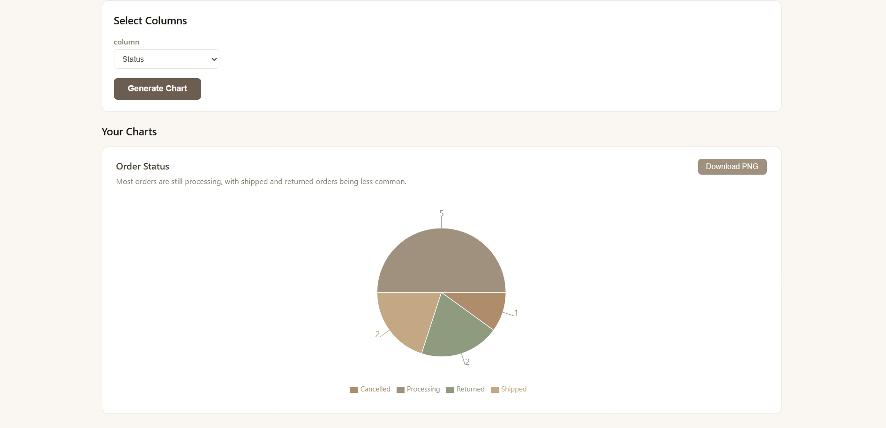
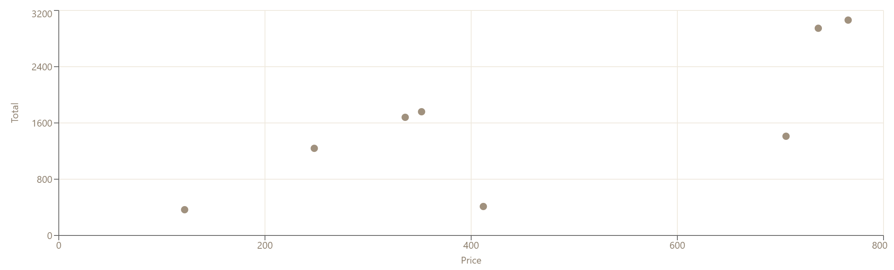

# Data-Cleaner
An interactive, browser-based data scrubbing and visualization workspace.


A full-stack web application for cleaning and processing CSV/XLSX files. Sign in with Google, upload a spreadsheet, run an automatic initial clean, then apply individual cleaning functions — with undo, draft history, and Neon database persistence.

## Screenshots

| | |
|:---:|:---:|
|  |  |
|  |  |
|  |  |

### Chart Example


## Why I Built This

Data preparation is notoriously inefficient. When faced with an unrefined dataset, analysts and software engineers generally face three suboptimal choices:

Spreadsheet Software: Applications like Excel or Google Sheets experience performance bottlenecks on larger datasets, rely on complex, error-prone formulas, and risk unintended manual overwrites.

Custom Scripting: Environment setup and dedicated code execution (such as pandas scripts in Python) introduce unnecessary overhead for routine data-cleansing operations.

Enterprise ETL Platforms: Commercial data-wrangling software carries steep licensing costs, complex onboarding, and significant administrative setup.

# USERS CAN CLEAN WITH  NO CODE REQUIRED.
### The Solution

Data-Cleaner bridge this gap by offering a responsive, browser-based workspace that combines the speed and deterministic execution of programmatic cleaning with an intuitive, code-free interface. It empowers users to inspect, execute batch transformations, and visualize datasets seamlessly within a single workflow.


##  What This Project Taught Me

Building a complex, browser-based ETL workspace with over 40+ transformation utilities completely shifted my engineering perspective:

* **The Imperative of Automated Testing:** When managing dozens of state-mutating functions, manual testing becomes a massive bottleneck. Writing unit tests for pure data functions proved essential for refactoring with confidence, catching boundary edge cases (`null` checks, regex escaping, string coercion), and preventing regressions.
* **Designing for High-Friction Workflows:** Real-world data is dirty and unpredictable. Giving users deterministic, instant feedback via live previews and search-by-intent search bars creates a far more reliable experience than relying solely on pure AI auto-cleaning.


## Features

### Authentication
- **Google Sign-In** via Firebase — protects all routes behind a login screen
- **Neon Postgres registration** — new users are automatically registered in the cloud database on sign-in

### Automatic Cleaning (Initial Clean)
Bundled into one action that must be run before other functions unlock. **Persists per file+sheet** so it only runs once:
- **Trim** — removes leading, trailing, and extra middle whitespace
- **Clean** — removes empty rows, trims strings, normalizes nulls
- **Remove Duplicates** — removes exact duplicate rows
- **Datatype Detection** — coerces numeric strings to numbers

Results are shown in a dismissible banner with row counts and stats.

### User-Selected Functions
Applied individually after the initial clean. Some require a column or multi-column selection.

#### Row Operations
- **Remove Empty Rows** — delete rows where every cell is empty
- **Remove Duplicates** — delete exact duplicate rows
- **Search Rows** — filter rows by a keyword across all columns
- **Sample Rows** — keep a random or first-N sample of rows
- **Reorder Columns** — rearrange column order
- **Filter Rows** — keep rows that match a condition (equals, greater than, less than, contains)
- **Sort Rows** — sort by one or more columns, ascending or descending

#### Column Operations
- **Remove Column** — drop a column from the dataset
- **Rename Column** — change a column header
- **Duplicate Column** — copy a column to a new column
- **Type Conversion** — cast a column to number, string, or boolean
- **Label Encode** — convert categorical text to integer labels
- **One-Hot Encode** — convert categories to true/false indicator columns

#### Text Case
- **Lowercase** — convert text to lowercase
- **Uppercase** — convert text to uppercase
- **Proper Case** — capitalize every word (Title Case)
- **Sentence Case** — capitalize the first letter of each cell

#### Find, Replace & Extract
- **Remove Special Characters** — strip symbols and punctuation
- **Remove Numbers** — strip digits from text
- **Collapse Whitespace** — normalize multiple spaces into one
- **Reverse Text** — reverse the characters in each cell
- **Replace Value** — replace an exact cell value with another
- **Rewrite (Substring)** — replace a substring anywhere inside a cell
- **Replace Text** — find and replace text across a column
- **Separate Column** — split one column into two by a delimiter
- **Truncate** — limit text to N characters
- **Pad Left** — pad text on the left to a fixed width
- **Pad Right** — pad text on the right to a fixed width
- **Extract Substring** — copy a slice of text to a new column

#### Text Analysis
- **Count Characters** — add a column with character counts
- **Count Words** — add a column with word counts
- **Contains** — add a true/false column for substring matches
- **Starts With** — add a true/false column for prefix matches
- **Ends With** — add a true/false column for suffix matches
- **Regex Extract** — extract text matching a regex pattern
- **Regex Replace** — replace text matching a regex pattern

#### Combine & Split
- **Join Columns** — combine multiple columns with a custom delimiter
- **Concatenate Columns** — combine multiple columns without a delimiter

#### Math
- **Math Operations** — 21 arithmetic/statistical operations via a two-step modal
  - *Single-column in-place:* Absolute Value, Ceiling, Floor, Negate, Round, Add Constant, Multiply Constant
  - *Single-column new column:* Square Root, Power, Logarithm, Cumulative Sum
  - *Two-column new column:* Add, Subtract, Multiply, Divide, Modulo, Min, Max, Percentage Of, Percentage Change
  - *Multi-column new column:* Sum Columns, Average Columns
- **Absolute Value** — convert numbers to their absolute value

#### Date Operations
- **Date Standardize** — reformat dates to a consistent format
- **Extract Year** — pull the year into a new column
- **Extract Month** — pull the month into a new column
- **Extract Day** — pull the day of month into a new column
- **Extract Weekday** — pull the weekday name into a new column
- **Add Days** — add or subtract days from a date column
- **Age from Date** — calculate age from a birthdate column
- **Is Weekend** — add a true/false weekend column
- **Date Difference** — compute days/hours/minutes between two date columns

#### Format & Validate
- **Currency Format** — format numbers as currency
- **Percentage Format** — format numbers as percentages
- **Email Valid** — add true/false email validation column
- **Phone Valid** — add true/false phone validation column
- **Flag Outliers** — mark numeric outliers using standard deviation

#### Values Panel
- **Get Unique Values** — list distinct values from a column
- **Replace Value** — replace exact cell values across the sheet
- **Rewrite (Substring)** — replace substrings across the sheet
- **Remove Row by Value** — delete rows where a column equals a value

### Empty Values Inspector
Interactive view to inspect and remove rows with empty/missing data:
- Color-coded table: red cells for empty values, yellow rows for rows with empties
- Stats dashboard: total rows, rows with empty cells, fully empty rows, total empty cells
- Batch actions: select all empty rows, select fully empty rows only, remove selected or all

### Data Visualization
AI-powered chart generation with 11 chart types. All charts are generated from the full dataset, saved to Neon Postgres, and enriched with AI-generated titles, axis labels, and insights.

| Chart Type       | Input                                  | Description                                      |
|------------------|----------------------------------------|--------------------------------------------------|
| Bar Chart        | 1 string column                        | Frequency of each category                       |
| Histogram        | 1 numeric column                       | Distribution across value bins                   |
| Pie Chart        | 1 string column                        | Proportional breakdown of categories             |
| Scatter Plot     | 2 numeric columns (X, Y)               | Relationship between two variables               |
| Line Graph       | X + Y columns (Y numeric)              | Trend over an ordered axis                       |
| Area Chart       | X + Y columns (Y numeric)              | Cumulative trend with filled area                |
| Box Plot         | Category + Value columns               | Distribution quartiles and outliers per category |
| Violin Plot      | Category + Value columns               | Density distribution per category                |
| Heatmap          | 2+ numeric columns                     | Pearson correlation matrix between columns       |
| Stacked Bar      | Category + Group columns (both string) | Group breakdown within each category             |
| Bubble Chart     | 3 numeric columns (X, Y, Size)         | Three-variable comparison with sized bubbles     |

- **AI Insights** — each chart gets an AI-generated title, axis labels, and a plain-English description of what stands out in the data
- **Persistent** — all chart data is saved to Neon Postgres and can be retrieved later
- **Download** — export any chart as a high-resolution PNG
- **Row counts** — every chart shows how many rows were processed from the dataset

### Search
- **Data Search Bar** — sits at the top of every sheet view; filters rows in real time by typing any keyword
  - Case-insensitive, searches across all columns simultaneously
  - Matching cells are highlighted; a live row count shows how many rows match
  - Resets automatically when switching sheets
- **Function Search Bar** — describe what you want in plain English (e.g. "remove repetition") and click **Search**; the AI interprets your intent and highlights the matching function cards

### Other
- **Neon Database Persistence** — files are saved to Neon Postgres on upload, synced on every operation, and loaded from Neon when revisiting
- **Undo** — revert the last applied operation one step at a time
- **Drafts** — saved versions of the sheet, most recent first, so you can jump back to any previous state
- **Export** — download the current sheet as XLSX (client-side)
- **AI Assistance** — multi-provider AI orchestration (OpenAI, Hugging Face, Gemini, Cerebras, Groq) with rate-limit handling and cooldowns

## Tech Stack

| Layer        | Technology                                         |
|--------------|----------------------------------------------------|
| Frontend     | React 19, React Router 7, Vite 8                  |
| Auth         | Firebase Authentication (Google Sign-In)           |
| Backend      | Vercel serverless (6 functions) + Express dev server |
| Database     | Neon Postgres (`@neondatabase/serverless`)         |
| Spreadsheets | xlsx (client-side parsing and export)              |
| Charts       | Recharts (bar, line, area, pie, scatter, composed) |
| AI           | OpenAI, Hugging Face, Google Gemini, Cerebras, Groq |
| Testing      | Jest (with experimental VM modules)                |
| Linting      | Oxlint                                             |

## Setup

```bash
npm install
```

Create a `.env` file with the following variables (no inline comments — dotenv doesn't support them):

```
# Database
DATABASE_URL=postgresql://...

# AI provider keys
OPENAI_API_KEY=
HUGGINGFACE_API_KEY=
GOOGLE_AI_API_KEY=
CEREBRAS_API_KEY=
GROQ_API_KEY=

# Firebase (client-side, VITE_ prefix required)
VITE_FIREBASE_API_KEY=
VITE_FIREBASE_AUTH_DOMAIN=
VITE_FIREBASE_PROJECT_ID=
VITE_FIREBASE_STORAGE_BUCKET=
VITE_FIREBASE_MESSAGING_SENDER_ID=
VITE_FIREBASE_APP_ID=
```

## Run

Start the full-stack dev server (frontend + API on one port):

```bash
npm run dev
```

This starts Express with Vite middleware at **http://localhost:3000** — serves both the React frontend and all API routes.

For frontend-only development:

```bash
npm run dev:client
```

## Tests

```bash
npm test
```

243 tests across 22 suites covering all automatic and user-choice functions.

## Build

```bash
npm run build
npm run preview   # preview the production build
```

## Architecture

### Serverless Functions (5 total — Vercel free-tier compatible)

Vercel's free tier allows **12 serverless functions max**. Early in development, each cleaning operation was its own serverless function (18 total), which exceeded the limit. The solution: consolidate all data transforms into a single unified handler (`api/operations.js`) that dispatches based on the `operation` field. Legacy routes like `/api/upper` are rewritten to `/api/operations` via `vercel.json` rewrites.

| Endpoint                | Handles                                           |
|-------------------------|---------------------------------------------------|
| `api/operations.js`     | All data transforms + 21 math operations (upper, lower, proper, clean, trim, duplicates, removeEmpty, removeColumn, missingValues, dateStandard, typeConversion, separate, join, concatenate, datatype, upload, math, absolute) |
| `api/charts.js`         | All 11 chart types — dispatches to graph functions (bar, histogram, pie, scatter, line, area, box, violin, heatmap, stacked bar, bubble) |
| `api/files.js`          | File CRUD in Neon Postgres (save, list, get, update, delete, versions) |
| `api/auth.js`           | User registration in Neon Postgres                |
| `api/ai.js`             | Multi-provider AI orchestration                   |
| `api/interpret.js`      | Natural-language function search interpretation   |

Legacy routes like `/api/upper` are rewritten to `/api/operations` via `vercel.json` rewrites. The operations handler auto-detects the operation from the URL path or the `operation` field in the request body.

### Dev Server

`server/index.js` — Express server that:
- Loads `.env` before dynamically importing API handlers
- Mounts all API routes with backward-compatible legacy paths
- Uses Vite as middleware for the React frontend (with HMR)
- Gracefully skips the AI module if its dependencies aren't installed

## Project Structure

```
├── api/                          # Serverless API (6 functions)
│   ├── functions/
│   │   ├── automatic/            # Auto-applied operations (trim, clean, duplicates, datatype)
│   │   └── user_choice/          # User-selected operations (case, dates, types, separate, join, math, etc.)
│   ├── database/
│   │   └── neon.js               # Neon Postgres database class with ensureTables()
│   ├── operations.js             # Unified handler for all data + math transforms
│   ├── charts.js                 # Unified handler for all 11 chart types
│   ├── files.js                  # File CRUD (save/list/get/update/delete/versions)
│   ├── auth.js                   # User registration endpoint
│   ├── ai.js                     # Multi-provider AI orchestration
│   └── interpret.js              # Natural-language function search interpretation
├── server/
│   └── index.js                  # Express dev server (API + Vite middleware)
├── src/
│   ├── functions/                # Client-side operation classes (automatic + user_choice; incl. getValues, search)
│   ├── graphs/
│   │   ├── functions/            # 11 chart functions (bar, histogram, pie, scatter, line, area, box, violin, heatmap, stacked, bubble)
│   │   ├── pages/                # ChartViewer component + ChartsPage UI
│   │   └── artificial_intelligence/ # AI insight generation for charts
│   ├── Components/
│   │   ├── login.jsx             # Login page — Google sign-in + Neon registration
│   │   ├── dashboard.jsx         # Dashboard — upload + file cards + Neon sync
│   │   ├── excel_file.jsx        # Excel/CSV shared view — search bar, sheet sidebar, functions, modals
│   │   ├── csv_file.jsx          # CSV view — single sheet + functions
│   │   └── emptyvalues.jsx       # Empty values inspector component
│   ├── utils/
│   │   └── cleaners.js           # Client-side cleaning utilities
│   ├── firebase.js               # Firebase config + auth exports
│   ├── App.jsx                   # React Router + auth guards
│   └── main.jsx                  # Entry point
├── ---test---/                   # Jest test files
├── wireframes.md                 # UI wireframes
├── database_schema.md            # Database schema docs
└── vercel.json                   # Vercel deployment config + rewrites
```

## Database Schema

Fifteen tables — **Users**, **Files**, **File_Versions**, **Graphs**, plus one per chart type (**bargraph**, **histogram**, **piechart**, **scatterplot**, **linegraph**, **boxplot**, **heatmap**, **stackedbar**, **areachart**, **bubblechart**, **violinplot**) — track users, uploaded files, version history (drafts/undo), chart images, and persisted chart data. Tables auto-create on first request via `ensureTables()`. See [database_schema.md](database_schema.md) for full details.

**Flow**

**Login** (Google sign-in + Neon registration) → **Dashboard** → Upload or open a file → **Excel view** (sheet sidebar) or **CSV view** (single sheet) → Run **Initial Clean** (one-time, persisted) → Results banner + functions unlock → **Search** rows in real time via the data search bar, or **describe what you want** in the function search bar → Apply functions (column picker or multi-column modal) → Inspect **Empty Values** → View drafts and undo changes → **Export** as XLSX.
